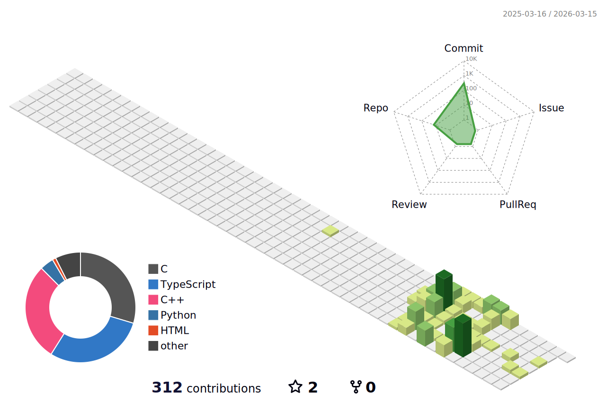

<!-- 
  【可选项】顶部背景图 
  如果你有喜欢的横幅图片，可以在这里添加：
  
-->

<!-- 头像 -->

<!-- 名字 -->
<h1>Hi there, I'm <a href="https://github.com/IceFerryLing">摆渡</a> 👋</h1>

<!-- 终端风格打字机 -->

 

I'm a student at **Harbin Institute of Technology (Shenzhen)**. 🎓
 
I am still a beginner in the vast world of computer science, humbly learning and exploring every day.

 

🔭 I’m currently working on **Backend Development**  
🌱 I’m currently learning **Deep Learning / Network Programming**  
💻 Tech Stack **Python / C++**  
🎵 Hobbies **Traditional Chinese Music**

---

### 🛠️ Tech Stack

  <!-- 编程语言 -->
  
  
  
  
   
  
  <!-- 开发工具 & IDE -->
  
  
  
  
   
  
  <!-- 嵌入式 & 硬件 -->
  
  
   
  
  <!-- 运维 & 虚拟化 -->
  
  
  
  
  
   
  
  <!-- 其他工具 -->
  
  

---

### 📊 GitHub Stats

  <!-- 
    GitHub 统计卡片 
    theme=radical 是一个很酷的配色，你也可以改成: dark, dracula, gruvbox 等
  -->
  
  

---

### 🏆 Contributions

<!-- 贪吃蛇动画 -->
<picture>
  <source media="(prefers-color-scheme: dark)" srcset="./dist/github-snake-dark.svg" />
  <source media="(prefers-color-scheme: light)" srcset="./dist/github-snake.svg" />
  
</picture>

 

<!-- 3D 贡献图 -->
<picture>
  <source media="(prefers-color-scheme: dark)" srcset="./profile-3d-contrib/profile-night-green.svg" />
  <source media="(prefers-color-scheme: light)" srcset="./profile-3d-contrib/profile-green-animate.svg" />
  
</picture>

