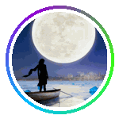
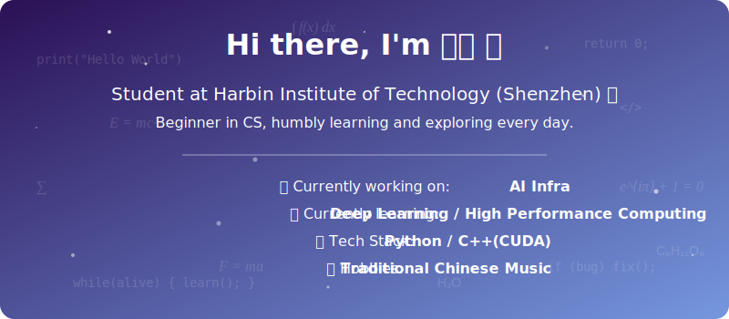
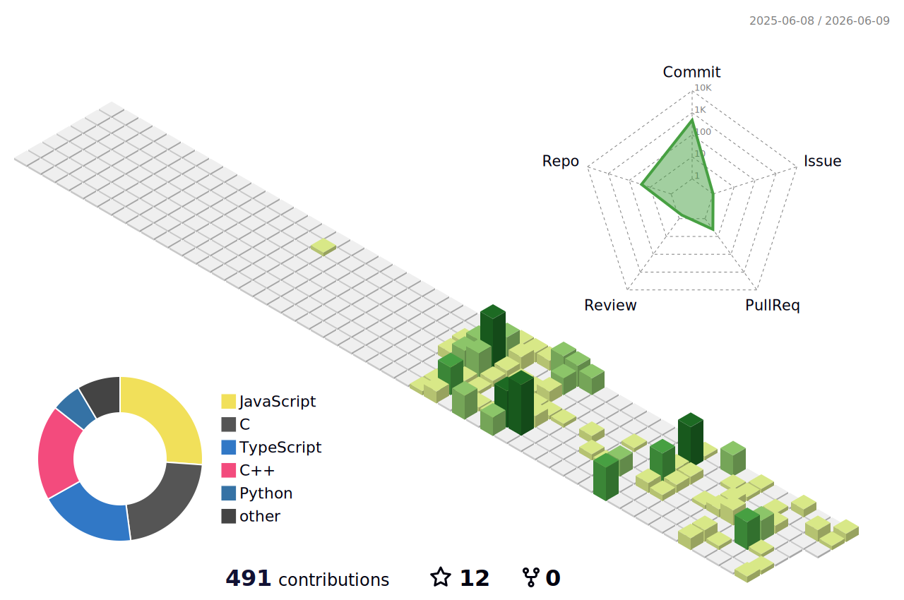

<!-- 
  【可选项】顶部背景图 
  如果你有喜欢的横幅图片，可以在这里添加：
  
-->

<!-- 动态头像 -->

 

<!-- 动态背景介绍卡片 -->

 

<!-- 终端风格打字机 -->

---

### 🛠️ Tech Stack

  <!-- 编程语言 -->
  
  
  
  
   

  <!-- 前端 / 后端 / 框架 -->
  
  
  
   

  <!-- 开发工具 & IDE -->
  
  
   

  <!-- 嵌入式 & 硬件 -->
  
  
   

  <!-- 数据库 -->
  
  
   

  <!-- 运维 & 虚拟化 / 安全 -->
  
  
  
  
  
   

---

### 📊 GitHub Stats

  <!-- 
    GitHub 统计卡片 
    theme=radical 是一个很酷的配色，你也可以改成: dark, dracula, gruvbox 等
  -->
  
  

---

### 🏆 Contributions

<!-- 贪吃蛇动画 -->
<picture>
  <source media="(prefers-color-scheme: dark)" srcset="./dist/github-snake-dark.svg" />
  <source media="(prefers-color-scheme: light)" srcset="./dist/github-snake.svg" />
  
</picture>

 

<!-- 3D 贡献图 -->
<picture>
  <source media="(prefers-color-scheme: dark)" srcset="./profile-3d-contrib/profile-night-green.svg" />
  <source media="(prefers-color-scheme: light)" srcset="./profile-3d-contrib/profile-green-animate.svg" />
  
</picture>

